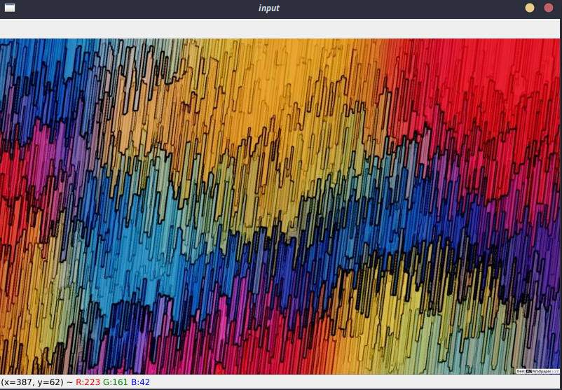
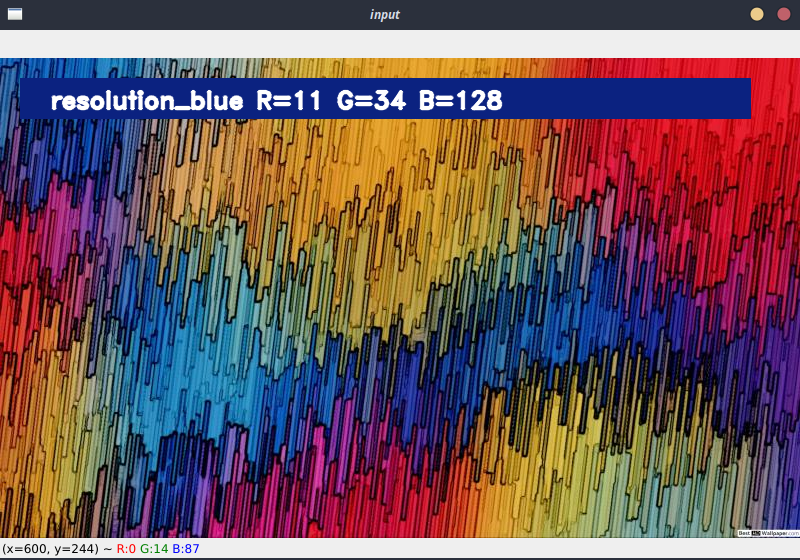

# Color Names
> Program that names the colors and shows the percentage of each RGB primary color 

## Table of Contents
* [General Info](#general-information)
* [Technologies Used](#technologies-used)
* [Features](#features)
* [Screenshots](#screenshots)
* [Setup](#setup)
* [Usage](#usage)
<!-- * [License](#license) -->

## General Information
- the program is used to name the colors.
- the colors to be named are indicated by the user by double clicking.
- program calculate the distance from each color and find the shortest one.
- All you need is python 3 and pip3 to install necessery packeges.

## Technologies Used
- OpenCV2 https://opencv.org/
- Pandas https://pandas.pydata.org/
- NumPY https://numpy.org/
- Argpase https://docs.python.org/3/library/argparse.html

## Features
List the ready features here:
- Naming Colors
- Show Pixel colors

## Screenshots

## Setup
### Packages and libraries installation

#### PiP3
If you do not have pip3 you should install it. You can also use conda (but I prefer pip3).

This package allow you to fast and easy install python3 packages

##### On Ubuntu/Mint/Debian

`$ sudo apt-get update`

`$ sudo apt-get -y install python3-pip`

##### On Windows

https://phoenixnap.com/kb/install-pip-windows

#### OpenCV for Python

`$ pip3 install opencv-python`

#### NumPy

`$ pip3 install numpy`

#### Pandas

`$ pip3 install pandas`

### Fast download

`$ git clone https://github.com/michalolejejek/Colors-Name-openCV/tree/main/ColorsName`

## Usage

To run script type in terminal (windows/linux):

`$ cd <path-to-folder-with-script>`

for example

`$ cd ColorsName`

Then you can run script using this command:

`$ python3 colors.py -i images.py`

After -i or --input you should give path or name of the file (when it is in the same directory as script)

Script Should open a window named "input". When user doubleclick on some area program displays name of the color.

## Dataset source

https://github.com/codebrainz/color-names

